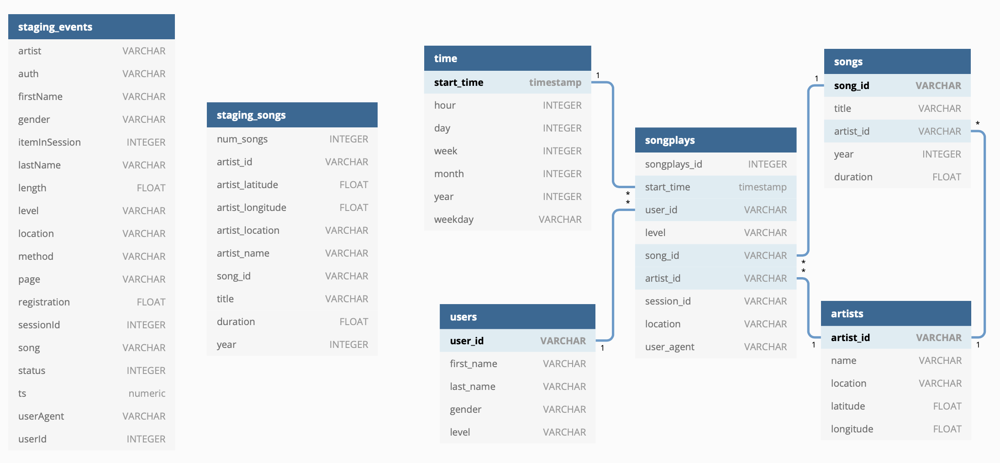

# Project 3: Data Warehouse in AWS using S3 and Redshift (IaaC)

This project is the third project of the Data Engineering Nanodegree Program of Udacity.

In this project, I will apply what I have learned on data warehouses and AWS and I'm going to build a ETL pipeline for a data warehouse using Python, S3 and Redshift.

## Introduction

A music streaming startup, Sparkify, has grown their user base and song database and want to move their processes and data onto the cloud. Their data resides in S3, in a directory of JSON logs on user activity on the app, as well as a directory with JSON metadata on the songs in their app.

As their data engineer, you are tasked with building an ETL pipeline that extracts their data from S3, stages them in Redshift, and transforms data into a set of dimensional tables for their analytics team to continue finding insights in what songs their users are listening to. You'll be able to test your database and ETL pipeline by running queries given to you by the analytics team from Sparkify and compare your results with their expected results.

## Data

In this ETL pipeline there are two types of data:

- **Song Dataset**: The first dataset is a subset of real data from the Million Song Dataset. Each file is in JSON format and contains metadata about a song and the artist of that song. The files are partitioned by the first three letters of each song's track ID. For example, here are filepaths to two files in this dataset.

- **Log Dataset**: The second dataset consists of log files in JSON format generated by this event simulator based on the songs in the dataset above. These simulate activity logs from a music streaming app based on specified configurations.

## Database schema

The database schema includes the following tables:

**Fact Table**
- **songplays**: Records in log data associated with song plays i.e. records with page NextSong
    - *songplay_id, start_time, user_id, level, song_id, artist_id, session_id, location, user_agent*

**Dimension Tables**
- **users**: Users in the app
    - *user_id, first_name, last_name, gender, level*
- **songs**: Songs in music database
    - *song_id, title, artist_id, year, duration*
- **artists**: Artists in music database
    - *artist_id, name, location, latitude, longitude*
- **time**: Timestamps of records in songplays broken down into specific units
    - *start_time, hour, day, week, month, year, weekday*

The visual design of the **star schema** of the database is the following:



In the left there are the two tables that they will act as a **staging tables**.

## Project structure

In addition to the data files, the project workspace includes six files:

1. [dwh_template.cfg]('dwh.cfg') file in where we store the AWS credentials and the Redshift configuration.
2. [sql_queries.py]('sql_queries.py') contains all the SQL queries to DROP and CREATE the tables in the Redshift cluster and also the SQL queries to move the data from S3 to the staging tables in Redshift and from there to the dimensional tables.
3. [create_tables.py]('create_tables.ipynb') file that creates the tables in the Redshift cluster and if the tables exist it will drop them first
4. [etl.py]('./etl.py') reads and processes the files from S3 and loads them into the Redshift cluster.
5. [setup_database.ipynb]('setup_database.ipynb') main file in this project that creats the Redshift cluster using the boto3 package (IaaC) and then it runs the two scripts (create_tables.py,etl.py) for creating the tables in the Redshift cluster and later put the data.
6. [README.md]('./README.md') provides discussion on your project.

## Installation

To run the files in this project first you need to install the following libraries.

Use the package manager [pip](https://pip.pypa.io/en/stable/) to install the following packages.

```bash
pip install pandas
pip install psycopg2
pip install boto3
pip install json
pip install configparser
pip install seaborn
```

Another option is to install Anaconda and use `conda` to install this packages.

The main file is `setup_database.ipynb`. This file will create the Redshift cluster in AWS automatically and later will run the scripts `create_tables.py` and `etl.py`. Finally, it will check if the data is in the database and it will show a small plot of the different levels in the table songplays.

## Contributing

Pull requests are welcome. For major changes, please open an issue first to discuss what you would like to change.

## License

This project is under the license [MIT](https://choosealicense.com/licenses/mit/).